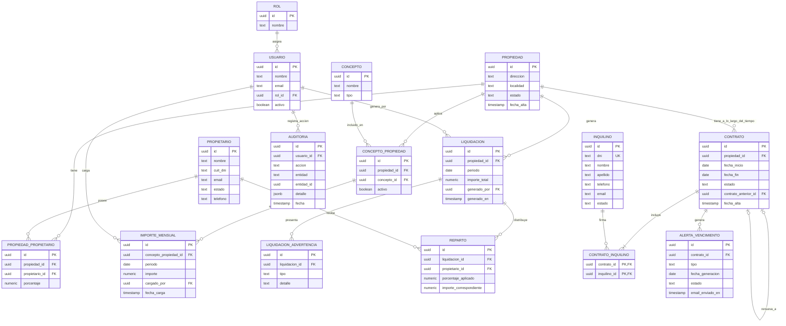

```mermaid
erDiagram
    PROPIEDAD ||--o{ PROPIEDAD_PROPIETARIO : tiene
    PROPIETARIO ||--o{ PROPIEDAD_PROPIETARIO : posee
    PROPIEDAD ||--o{ CONCEPTO_PROPIEDAD : aplica
    CONCEPTO ||--o{ CONCEPTO_PROPIEDAD : incluido_en
    CONCEPTO_PROPIEDAD ||--o{ IMPORTE_MENSUAL : registra
    USUARIO ||--o{ IMPORTE_MENSUAL : carga
    PROPIEDAD ||--o{ LIQUIDACION : genera
    LIQUIDACION ||--o{ LIQUIDACION_ADVERTENCIA : presenta
    LIQUIDACION ||--o{ REPARTO : distribuye
    PROPIETARIO ||--o{ REPARTO : recibe
    USUARIO ||--o{ LIQUIDACION : genera_por
    ROL ||--o{ USUARIO : asigna
    USUARIO ||--o{ AUDITORIA : registra_accion
    PROPIEDAD ||--o{ CONTRATO : tiene_a_lo_largo_del_tiempo
    CONTRATO ||--|{ CONTRATO_INQUILINO : incluye
    INQUILINO ||--o{ CONTRATO_INQUILINO : firma
    CONTRATO |o--o| CONTRATO : renueva_a
    CONTRATO ||--o{ ALERTA_VENCIMIENTO : genera

    PROPIEDAD {
        uuid id PK
        text direccion
        text localidad
        text estado
        timestamp fecha_alta
    }

    PROPIETARIO {
        uuid id PK
        text nombre
        text cuit_dni
        text email
        text estado
        text telefono
    }

    PROPIEDAD_PROPIETARIO {
        uuid id PK
        uuid propiedad_id FK
        uuid propietario_id FK
        numeric porcentaje
    }

    CONCEPTO {
        uuid id PK
        text nombre
        text tipo
    }

    CONCEPTO_PROPIEDAD {
        uuid id PK
        uuid propiedad_id FK
        uuid concepto_id FK
        boolean activo
    }

    IMPORTE_MENSUAL {
        uuid id PK
        uuid concepto_propiedad_id FK
        date periodo
        numeric importe
        uuid cargado_por FK
        timestamp fecha_carga
    }

    LIQUIDACION {
        uuid id PK
        uuid propiedad_id FK
        date periodo
        numeric importe_total
        uuid generado_por FK
        timestamp generado_en
    }

    LIQUIDACION_ADVERTENCIA {
        uuid id PK
        uuid liquidacion_id FK
        text tipo
        text detalle
    }

    REPARTO {
        uuid id PK
        uuid liquidacion_id FK
        uuid propietario_id FK
        numeric porcentaje_aplicado
        numeric importe_correspondiente
    }

    USUARIO {
        uuid id PK
        text nombre
        text email
        uuid rol_id FK
        boolean activo
    }

    ROL {
        uuid id PK
        text nombre
    }

    AUDITORIA {
        uuid id PK
        uuid usuario_id FK
        text accion
        text entidad
        uuid entidad_id
        jsonb detalle
        timestamp fecha
    }

    INQUILINO {
        uuid id PK
        text dni UK
        text nombre
        text apellido
        text telefono
        text email
        text estado
    }

    CONTRATO {
        uuid id PK
        uuid propiedad_id FK
        date fecha_inicio
        date fecha_fin
        text estado
        uuid contrato_anterior_id FK
        timestamp fecha_alta
    }

    CONTRATO_INQUILINO {
        uuid contrato_id PK,FK
        uuid inquilino_id PK,FK
    }

    ALERTA_VENCIMIENTO {
        uuid id PK
        uuid contrato_id FK
        text tipo
        date fecha_generacion
        text estado
        timestamp email_enviado_en
    }
```